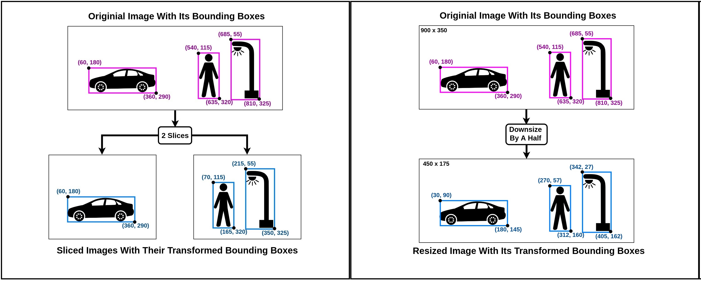

[](https://badge.fury.io/py/image-bbox-slicer) [](LICENSE)
# Image and Bounding Box Slicer-Resizer (image_bbox_slicer)

This easy-to-use library is a data transformer sometimes useful in Object Detection and Segmentation tasks. With only a few lines of code, one can slice images and their bounding box annotations into smaller tiles, both into specific sizes and into any arbitrary number of equal parts. The tool also supports resizing of images and their bounding box annotations, both by specific sizes and by a resizing/scaling factor. Read the docs [here](https://image-bbox-slicer.readthedocs.io/en/latest/).

<div align="center">

</div>

Currently, this library only supports bounding box annotations in [PASCAL VOC](http://host.robots.ox.ac.uk/pascal/VOC/) format. And as of now, there is **no command line execution support**. Please raise an issue if needed. 

## Installation
```python
pip install image_bbox_slicer
```

This tool was tested on both Windows and Linx. Works well with Python 3.4 and higher versions and requires: 
```python
Pillow
numpy
pascal-voc-writer
matplotlib
```

## Slicing Demo: [Docs](https://image-bbox-slicer.readthedocs.io/en/latest/slicing-demo.html) and [Notebook](https://github.com/acl21/image_bbox_slicer/blob/master/Slicing_Demo.ipynb)

## Resizing Demo: [Docs](https://image-bbox-slicer.readthedocs.io/en/latest/resizing-demo.html) and [Notebook](https://github.com/acl21/image_bbox_slicer/blob/master/Resizing_Demo.ipynb) 