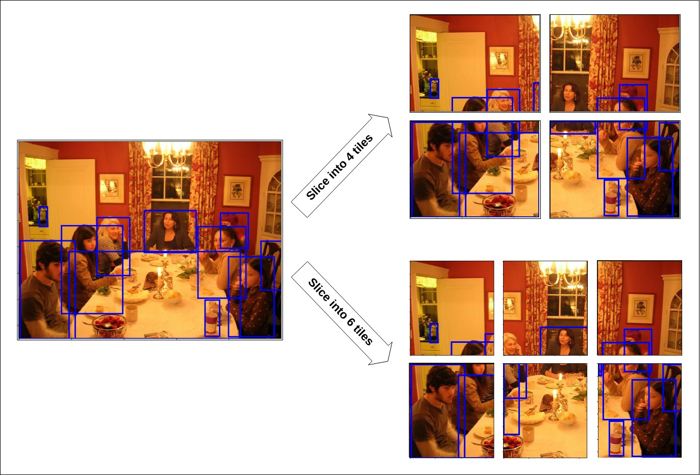
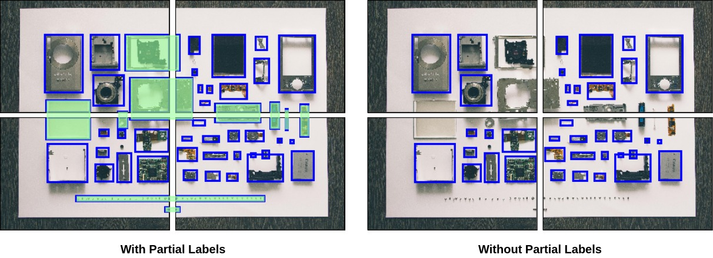
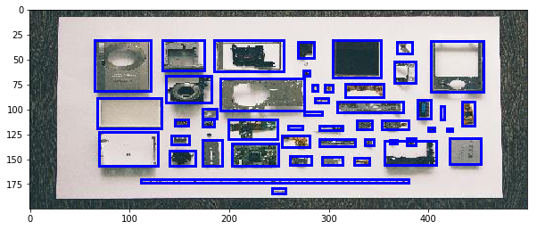
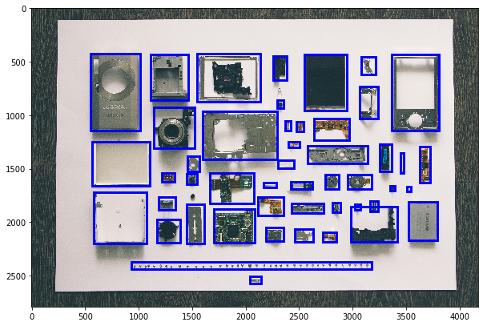

[](https://badge.fury.io/py/image-bbox-slicer) [](LICENSE)
# image_bbox_slicer 

This easy-to-use library splits images and their bounding box annotations into tiles, both into specific sizes and into any arbitrary number of equal parts. It can also resize them, both by specific sizes and by a resizing/scaling factor. Read the docs [here](https://image-bbox-slicer.readthedocs.io/en/latest/).

<div align="center">

</div>

Currently, this library only supports bounding box annotations in [PASCAL VOC](http://host.robots.ox.ac.uk/pascal/VOC/) format. And as of now, there is **no command line execution support**. Please raise an issue if needed. 

## Installation
```python
$ pip install image_bbox_slicer
```

Works with Python 3.4 and higher versions and requires:
```python
Pillow==5.4.1
numpy==1.16.2
pascal-voc-writer==0.1.4
matplotlib==3.0.3
```

## Usage - A Quick Demo
_Note: This usage demo can be found in `demo.ipynb` in the repo._

```python
import image_bbox_slicer as ibs
```

### Create And Configure `Slicer` Object

#### Setting Paths To Source And Destination Directories.
You must configure paths to source and destination directories like the following. 

```python
im_src = './src/images'
an_src = './src/annotations'
im_dst = './dst/images'
an_dst = './dst/annotations'

slicer = ibs.Slicer()
slicer.config_dirs(img_src=im_src, ann_src=an_src, 
                   img_dst=im_dst, ann_dst=an_dst)
```

#### Dealing With Partial Labels
<div align="center">

</div>

The above images show the difference in slicing with and without partial labels. In the image on the left, all the box annotations masked in <span style="color:green">**green**</span> are called Partial Labels. 

Configure your slicer to either ignore or consider them by setting `Slicer` object's `keep_partial_labels` instance variable to `True` or `False` respectively. By default it is set to `False`.


```python
slicer.keep_partial_labels = True
```

#### Dealing With Empty Tiles


An empty tile is a tile with no "labels" in it. The definition of "labels" here is tightly coupled with the user's preference of partial labels. If you choose to keep the partial labels (i.e. `keep_partial_labels = True`), a tile with a partial label is not treated as empty. If you choose to not keep the partial labels (i.e. `keep_partial_labels = False`), a tile with one or more partial labels is considered empty. 

Configure your slicer to either ignore or consider empty tiles by setting `Slicer` object's `ignore_empty_tiles` instance variable to `True` or `False` respectively. By default it is set to `True`.  


```python
slicer.ignore_empty_tiles = False
```

#### Before-After Mapping

You can choose to store the mapping between file names of the images before and after slicing by setting the `Slicer` object's `save_before_after_map` instance variable to `True`. By default it is set to `False`.

Typically, `mapper.csv` looks like the following:
```
| old_name   | new_names                       |
|------------|---------------------------------|
| 2102       | 000001, 000002, 000003, 000004  |
| 3931       | 000005, 000005, 000007, 000008  |
| test_image | 000009, 000010, 000011, 000012  |
| ...        | ...                             |
```


```python
slicer.save_before_after_map = True
```

### Slicing

#### Images and Bounding Box Annotations Simultaneously

#### By Number Of Tiles


```python
slicer.slice_by_number(number_tiles=4)
slicer.visualize_sliced_random()
```

<div align="center">


</div>


#### By Specific Size

```python
slicer.slice_by_size(tile_size=(418,279), tile_overlap=0)
slicer.visualize_sliced_random()
```


<div align="center">


</div>

*Note: `visualize_sliced_random()` randomly picks a recently sliced image from the directory for plotting.*

### Other Slicing Functions

#### By Number Of Tiles
```python
slicer.slice_images_by_number(number_tiles=4)
```

#### By Specific Size
```python
slicer.slice_images_by_size(tile_size=(418,279), tile_overlap=0)
```

#### Slicing Only Bounding Box Annotations
#### By Number Of Tiles
```python
slicer.slice_bboxes_by_number(number_tiles=4)
```

#### By Specifc Size
```python
slicer.slice_bboxes_by_size(tile_size=(418,279), tile_overlap=0)
```

### Resizing 


#### Images and Bounding Box Annotations Simultaneously
#### By Specific Size


```python
slicer.resize_by_size(new_size=(500,200))
slicer.visualize_resized_random()
```





#### By A Resize Factor


```python
slicer.resize_by_factor(resize_factor=0.05)
slicer.visualize_resized_random()
```




_Note:_

*`visualize_resized_random()` randomly picks a recently resized image from the destination directory for plotting.*


### Other Resizing Functions

#### Resizing Separately

#### Only Images

* #### By Specific Size

```python
slicer.resize_images_by_size(new_size=(500,200))
```

* #### By Resize Factor

```python
slicer.resize_images_by_factor(resize_factor=0.05)
```

####  Only Bounding Box Annotations

* #### By Specific Size
```python
slicer.resize_bboxes_by_size(new_size=(500,200))
```

* #### By Resize Factor
```python
slicer.resize_bboxes_by_factor(resize_factor=0.05)
```