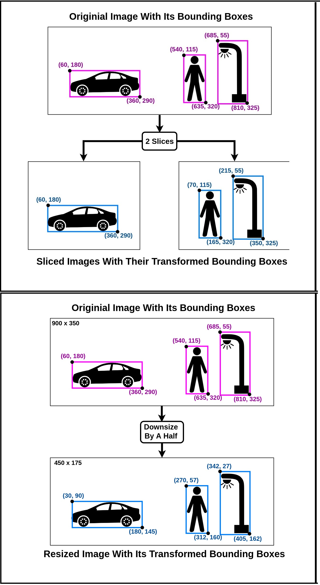

# Image and Box Annotation Slicer

This easy-to-use library is a data transformer sometimes useful in Object Detection tasks. It splits images and its bounding box annotations into tiles, both into specific sizes and into any arbitrary number of equal parts. It can also resize them, both by specific sizes and by a resizing/scaling factor.

<div align="center">

</div>
<br>
Currently, this library only supports bounding box annotations in [PASCAL VOC](http://host.robots.ox.ac.uk/pascal/VOC/) format. And as of now, there is **no command line execution support**.

## Installation
```python
$ pip install image_bbox_slicer
```

Works with Python 3.4 and higher versions and requires:
```
Pillow==5.4.1
numpy==1.16.2
pascal-voc-writer==0.1.4
matplotlib==3.0.3
```
