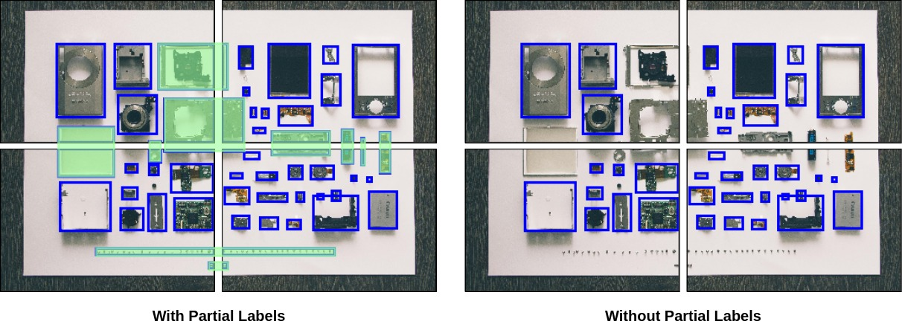
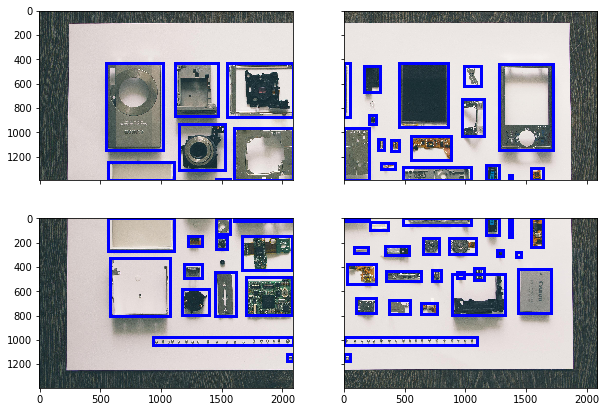
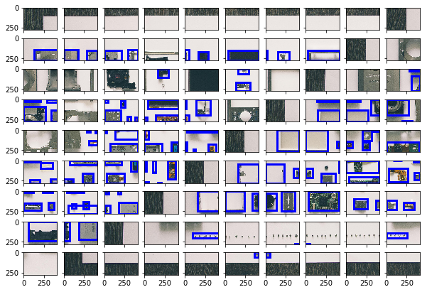
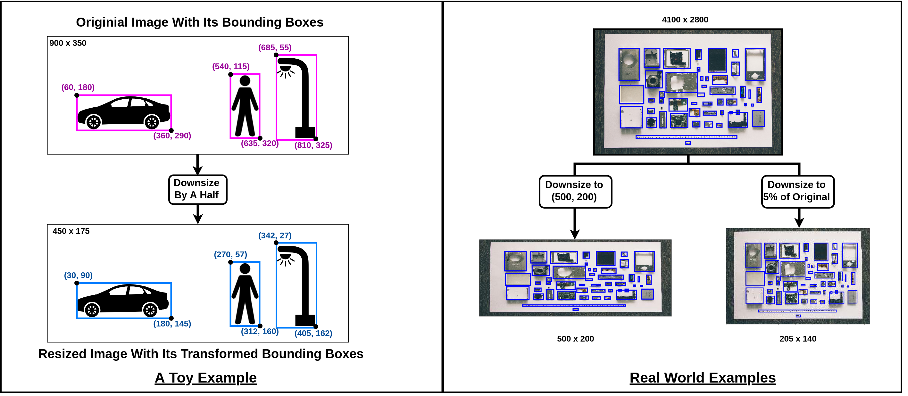

## Create And Configure `Slicer` Object
_Note: This usage demo can be found in `demo.ipynb` in the project's [repo](https://github.com/akshaychandra21/image_bbox_slicer)._

Setting Paths To Source And Destination Directories
You must configure paths to source and destination directories like the following. 

```python
import image_bbox_slicer as ibs

im_src = './src/images'
an_src = './src/annotations'
im_dst = './dst/images'
an_dst = './dst/annotations'

slicer = ibs.Slicer()
slicer.config_dirs(img_src=im_src, ann_src=an_src, 
                   img_dst=im_dst, ann_dst=an_dst)
```

## Partial Labels



The above images show the difference in slicing with and without partial labels. In the image on the left, all the box annotations masked in <span style="color:green">**green**</span> are called Partial Labels. 

Configure your slicer to either ignore or consider them by setting `Slicer` object's `keep_partial_labels` instance variable to `True` or `False` respectively. By default it is set to `False`.

```python
slicer.keep_partial_labels = True
```

## Empty Tiles


An empty tile is a tile with no "labels" in it. The definition of "labels" here is tightly coupled with the user's preference of partial labels. If you choose to keep the partial labels (i.e. `keep_partial_labels = True`), a tile with a partial label is not treated as empty. If you choose to not keep the partial labels (i.e. `keep_partial_labels = False`), a tile with one or more partial labels is considered empty. 

Configure your slicer to either ignore or consider empty tiles by setting `Slicer` object's `ignore_empty_tiles` instance variable to `True` or `False` respectively. By default it is set to `True`.

```python
slicer.ignore_empty_tiles = False
```

## Before-After Mapping

You can choose to store the mapping between file names of the images before and after slicing by setting the `Slicer` object's `save_before_after_map` instance variable to `True`. By default it is set to `False`.

Typically, `mapper.csv` looks like the following:
```
| old_name   | new_names                       |
|------------|---------------------------------|
| 2102       | 000001, 000002, 000003, 000004  |
| 3931       | 000005, 000005, 000007, 000008  |
| test_image | 000009, 000010, 000011, 000012  |
| ...        | ...                             |
```


```python
slicer.save_before_after_map = True
```

## Slicing

Slicing both images and box annotations at the same time.

** By Number Of Tiles ** 


```python
slicer.slice_by_number(number_tiles=4)
slicer.visualize_random()
```




** By Specific Size ** 


```python
slicer.slice_by_size(tile_size=(418,279), tile_overlap=0)
slicer.visualize_random()
```




*Note: `visualize_sliced_random()` randomly picks a recently sliced image from the directory for plotting.*

## Resizing


Images and Bounding Box Annotations Simultaneously

** By Specific Size ** 


```python
slicer.resize_by_size(new_size=(500,200))
slicer.visualize_resized_random()
```


** By A Resize Factor **


```python
slicer.resize_by_factor(resize_factor=0.05)
slicer.visualize_resized_random()
```


_Note:_ 
*`visualize_resized_random()` randomly picks a recently resized image from the destination directory for plotting.*


